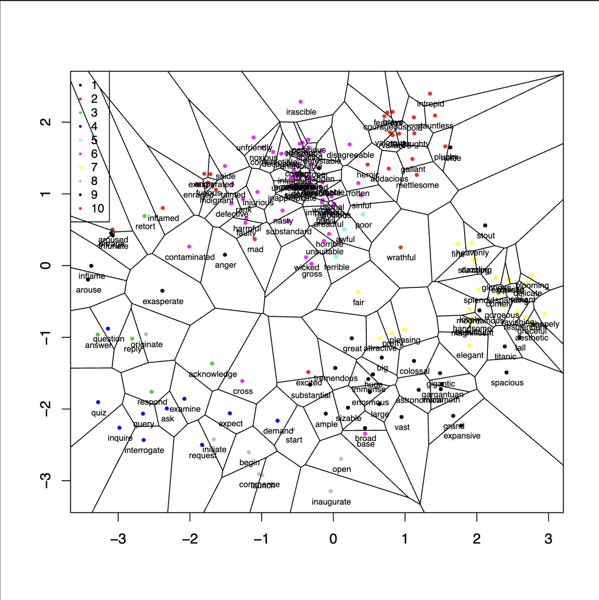

## Overview
The key dimensionality reduction techniques: ISOMAP, PCA (Principal Component Analysis), and t-SNE (t-Distributed Stochastic Neighbor Embedding) are presented and compared. The focus is on experimenting with ISOMAP's parameters and contrasting its performance with PCA and t-SNE, providing a concise yet comprehensive insight into dimensionality reduction strategies.

## Background

The data are vector representations of words in a latent (unknown) high-dimensional space i.e. embedding.

## Data
300-dimensional word2vec vector embeddings in the file *data.csv* with corresponding word labels in *labels.txt* for each line. Each of these words comes from one of 10 selected classes of synonyms, which can be recognized (and depicted) w.r.t. labels denoted in the file *colors.csv*

## Implementation of the ISO-MAP dimensionality reduction procedure
- Used *k*-NN method to construct the neighborhood graph (sparse matrix). # Sparse matrix is a matrix which contains very few non-zero elements. 
- Computed shortest-paths (geodesic) matrix (Floyd-Warshall algorithm)
- Projected the geodesic distance matrix into 2D space with (Classical) Multidimensional Scaling
  
An expected result (for *k* = 5) should look similar (not necessarily exactly the same) to following

## Results
For each point, we found the k nearest neighbors, selecting points based on a fixed number. We then connected each point with its nearest neighbors, where the distance between them was equal to the Euclidean distance between the points. Using the Floyd-Warshall algorithm, implemented according to the algorithm in the reference above, we calculated the shortest paths between all pairs of points, thus approximating the geodesic distance between points. This was followed by dimensionality reduction using MDS (Multidimensional Scaling), which preserves distances between points (i.e., points that were close to each other before reduction should remain close afterwards).

Finding an appropriate number of neighbors k is not straightforward. Too small a k led to indistinguishable clusters and the distance between points in the graph was too small, while too large values led to class overlap. Optimal values for k seem to be k = 5, k = 4, k = 6, and at k = 7, there was visible overlap.
Based on visual observation, the ISOMAP method appears to be the most suitable for the given dataset, for k = 5.
Compared to the ISOMAP method, the PCA method seems to be less accurate. Points classified into the same class overlap with points from other classes and are too close to each other and overlap. This also applies to the t-SNE method, which also seems to be less accurate than ISOMAP.

## The effect of dimensionality reduction on a classiffication algorithm

- **ISOMAP ACC**: 0.761666666666667 with k = 5
- **PCA ACC**: 0.743333333333333
- **t-SNE ACC**: 0.606666666666667

The resulting classification accuracy corresponds to the interpretation from the visual comparison of the methods (for k = 5). However, upon repeated application of the methods to the same dataset, these values changed (in the case of changing k for ISOMAP), and for t-SNE, it varied from 0.6 to the accuracy values of the PCA method. The ISOMAP method proves to be the most accurate for appropriately chosen values of k, followed by PCA, and finally t-SNE.
